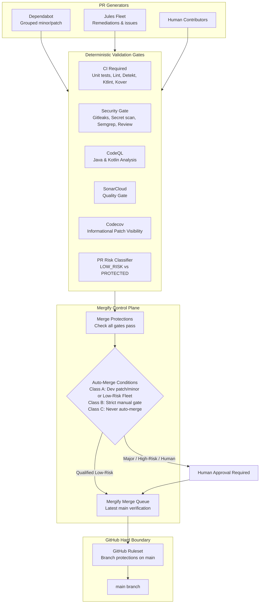

# Autonomous Repository Maintenance Architecture

## 1. Architecture & Philosophy

This repository implements a **safe, fail-closed, highly autonomous maintenance system** designed to keep dependencies, toolchains, security postures, and CI workflows up to date with minimal manual engineering intervention.



---

## 2. Authority Boundaries & Single Merge Engine

To eliminate race conditions and split-brain states:
- **Single Merge Authority:** **Mergify** is the sole automated merge authority.
- **Jules Fleet Merge:** Permanently read-only audit mode (`JULES_FLEET_AUTO_MERGE_ENABLED=false`). The workflow never invokes Jules merge; Mergify is the sole automated merge authority.
- **Native GitHub Merge Queue:** Disabled to prevent conflicting dual-queue synchronization.

---

## 3. Dependabot Configuration

- **Authoritative Dependency Updater:** Dependabot runs weekly on Sundays (`schedule: interval: weekly`).
- **All Ecosystems Covered:**
  - `github-actions`: `/`
  - `gradle`: `/`
  - `pip`: `/scripts/ci`
  - `npm`:
    - `/side-projects/admin-notifications`
    - `/side-projects/cloudflare/workers/admin-api`
    - `/side-projects/cloudflare/workers/content-api`
    - `/side-projects/cloudflare/workers/ssv-callback`
    - `/side-projects/firebase/functions`
    - `/side-projects/firebase/rules-tests`
- **Rebase Strategy:** The configuration intentionally does **not** set `rebase-strategy: disabled`, so GitHub's default automatic Dependabot rebasing remains active. Long-lived update PRs refresh after `main` changes instead of becoming manual conflict debt, while Mergify still serializes the actual merge queue.
- **Grouping:** Development dependencies are grouped for patch/minor updates; production dependencies are grouped only for patch updates. Production minors and semver-majors remain standalone/manual. Mergify evaluates the raw Dependabot commit metadata (for example `direct:development` and `direct:production`), so the policy matches the `:development` / `:production` suffixes rather than shortened labels. This prevents valid grouped updates from being silently ineligible while mixed groups still fail closed.
- **Sensitive/Protected Dependencies Isolated:** Dependabot group exclusions mirror the Mergify trust boundary. Android/Kotlin toolchains, auth/crypto, Billing, Firebase/Cloudflare deploy tooling, Gradle wrapper, and transitive dependencies pinned from protected root build files are excluded from groups. This prevents one sensitive/root-build update from making an entire safe patch batch permanently manual.

---

## 4. Jules Fleet Automation

- **Goal-Driven Self-Healing:** Jules analyzes CI health, dependency posture, and security alerts, raising focused remediation issues and PRs.
- **Safety Boundaries:**
  - Automated PRs run the deterministic `classify_pr.py` classifier.
  - Low-risk classification alone is insufficient for Fleet readiness. For the current pinned Fleet runtime, `fleet-merge-ready` is granted only when the same-repository branch ends in a 10+ digit Jules session ID, the PR body contains `jules.google.com/task/<same id>`, and a closing issue carries the `fleet` label. Legacy `jules/*` + `s-*` session provenance remains supported; unrelated low-risk PRs receive no Fleet-ready label.
  - Any PR touching protected infrastructure receives `fleet-review-required` and cannot auto-merge.

---

## 5. Mergify Engine

Configured in `.mergify.yml` using the latest official schema:
- **`merge_protections`**: Enforces that hard gates pass before any PR is merge-eligible:
  - `CI Required`
  - `Security Required` (aggregates in-workflow: Security Gate + Repository Security)
  - `Secret Scan` (from security.yml workflow)
  - `Workflow Audit` (from security.yml workflow)
  - `Dependency Review` (from security.yml workflow)
  - `SonarCloud Code Analysis`
- **`auto_merge_conditions`**: Restricted solely to:
  - Dependabot **dev-only** groups with patch/minor updates, or **production-only** groups where every update is a patch, excluding sensitive coordinates and protected control-plane files. Mixed development/production groups fail closed because Mergify list conditions otherwise use "any" semantics. GitHub Actions updates remain manual because `.github/**` is part of the trust boundary.
  - Jules Fleet PRs verified by correlated same-repository session provenance, a closing `fleet` issue, `risk:low`, and `fleet-merge-ready`.
  - Circuit breaker label `-label = automerge:disabled`.
- **`queue_rules`**:
  - `name: default`, `merge_method: squash`, `batch_size: 1`.

---

## 6. GitHub Rulesets (Hard Security Boundary)

**Current State: ACTIVE** — The live `main-branch-protection` ruleset is applied and continuously drift-checked by the maintenance controller.

The repository ruleset on `main` enforces:
- Required PR before merging.
- No direct push.
- No force push.
- No branch deletion.
- Required status checks: `CI Required`, `Security Required`, `Secret Scan`, `Workflow Audit`, `Dependency Review`, `SonarCloud Code Analysis`, `Mergify Merge Protections`, `Analyze Java and Kotlin`.
- GitHub `strict_required_status_checks_policy` is intentionally **false**. Mergify's queue updates PRs against the latest base before testing; GitHub's separate "Require branches to be up to date before merging" flag is incompatible with Mergify batch-PR checks and would deadlock the queue.

**Do NOT enable GitHub native merge queue.** Mergify queue remains the only queue.

---
## 7. Security Scanning Architecture

The `security.yml` workflow runs four security checks:

| Check | Job Name | Type | Required for Merge |
|-------|----------|------|-------------------|
| Secret Scan | `secret-scan` | Hard (Gitleaks full history + SARIF) | Yes |
| Workflow Audit | `workflow-audit` | Hard (validate_security_pipeline.py + validate_android_toolchain_config.py) | Yes |
| Dependency Review | `dependency-review` | Hard (GitHub native action, fail-on-severity: high) | Yes |
| Semgrep SAST | `semgrep` | **Advisory** (`continue-on-error: true`) | No |

**Transitive security floors:** `config/supply-chain-policy.json` owns reviewed version overrides for vulnerable build/plugin and project transitive dependencies. The hard Supply-chain Policy gate verifies each coordinate in `settings.gradle.kts` and requires the same floor in both the root plugin/buildscript classpath and every project configuration in `build.gradle.kts`. Current policy aligns the Bouncy Castle family at 1.86, Wire runtime/JVM at 6.4.7, Logback Core/Classic at 1.5.34, and retains reviewed floors for jose4j, JDOM, Commons Lang, HttpClient, and Guava. These control-plane files remain Class C protected paths and are never autonomous-merge candidates.

**Decision: actionlint is advisory.**
- The `workflow-audit` job runs `actionlint` with `continue-on-error: true`, so it cannot block the Workflow Audit check.
- The `workflow-audit` hard gate is based solely on its deterministic hard validators: `validate_security_pipeline.py` and `validate_android_toolchain_config.py`.
- Semgrep SAST also runs with `continue-on-error: true` and is advisory.
- This decision is intentional: actionlint and Semgrep may produce false positives on legitimate patterns; they provide visibility via SARIF upload but do not block merges.

**Hard security checks required for merge (in Mergify + Ruleset):**
- `Secret Scan`
- `Workflow Audit`
- `Dependency Review`

---
## 8. SonarQube Cloud Integration

- **Model:** GitHub App Automatic Analysis / Clean-as-You-Code.
- **Status:** Hard Quality Gate required for merge eligibility.
- **Protection:** External advisory bots with rate limits (e.g. CodeRabbit) are never treated as blocking hard gates.

---

## 9. Codecov Integration

- **Engine:** `codecov/codecov-action` pinned to full commit SHA (`0fb7174895f61a3b6b78fc075e0cd60383518dac`, v5.5.5).
- **Authentication:** OIDC tokenless upload (`use_oidc: true` with `id-token: write` permission). No `CODECOV_TOKEN` secret required for public repositories.
- **Policy:** Informational (`informational: true` in `codecov.yml`, `fail_ci_if_error: false` in workflows).
- **Local Source of Truth:** Kover remains the authoritative coverage validator.
- **Bootstrap:** If OIDC fails (e.g., private repo), create `CODECOV_TOKEN` secret manually in GitHub repo settings.

---
## 10. CodeQL & Kotlin Compatibility Ceiling

- **Ceiling Policy:** Recorded in `config/codeql-compatibility-policy.json`.
- **Enforcement:** `scripts/ci/codeql_kotlin_compatibility_test.py` validates the live extractor boundary rather than assuming a documentation-only ceiling. The pinned Actions runtime currently downloads CodeQL bundle `2.27.0`; a repository canary on 2026-09-22 proved that its Kotlin interceptor rejects `2.4.20` and supports versions strictly below `2.4.20`, so the configured compiler remains `2.4.0`. Dependabot advisory `GHSA-r937-wjx7-w2jp` / `CVE-2026-53914` cannot be upgraded safely until a newer CodeQL bundle accepts a fixed Kotlin compiler; the exception and re-test deadline are tracked in `config/codeql-compatibility-policy.json`.
- **Dependabot:** The required `Analyze Java and Kotlin` job also runs for Dependabot pull requests. GitHub code scanning supports result upload for `pull_request`-triggered Dependabot analysis, so the required CodeQL context cannot be skipped on PRs intended for autonomous merge.

---

## 10. Autonomy Risk Tiers

| Tier | PR Types | Policy |
|---|---|---|
| **Class A (Autonomous)** | Non-sensitive Dependabot development patch/minor, non-sensitive production patch, Jules Fleet `risk:low` outside protected paths | Auto-queued and merged by Mergify after all hard gates pass |
| **Class B (Enhanced Guarded)** | Selected non-sensitive runtime/side-project production patches | Eligible only when the Mergify contract permits them and full CI/integration gates pass |
| **Class C (Manual Approval Required)** | Any semver-major bump, GitHub Actions updates, Gradle/Kotlin/AGP/KSP toolchain, root build control files (`build.gradle.kts`, `settings.gradle.kts`, `gradle.properties`, wrapper), Auth/Crypto, Billing, DB migrations, `.github/**`, `.mergify.yml`, `scripts/ci/**` | Never auto-merged; human approval required |

---

## 12. Circuit Breakers & Kill Switches

1. **Global Maintenance Kill Switch:**
   - Missing or any value other than `AUTONOMOUS_MAINTENANCE_ENABLED=true` is fail-closed for write-capable autonomous maintenance.
   - Jules Fleet analyze/dispatch/classify/merge jobs require this switch **and** `JULES_FLEET_ENABLED=true`.
   - Scheduled all-goals Analyze has an additional fail-closed switch: `JULES_FLEET_SCHEDULED_ANALYZE_ENABLED=true`. Keep it false by default because the pinned Fleet Analyze command creates one Jules analyzer session per goal on every run.
   - Maintenance health evaluation remains read-only when disabled; dashboard issue synchronization is gated by this switch.
2. **Global Auto-Merge Authorization:**
   - Missing or `AUTONOMOUS_MERGE_ENABLED=false` means the trusted label controller removes `automerge:enabled` from every open PR.
   - When enabled, the controller grants `automerge:enabled` only to explicit candidate classes: Dependabot PRs, or same-repository Fleet PRs whose branch/body contain a correlated Jules session ID plus `fleet-merge-ready` + `risk:low`; drafts, forks, unrelated human PRs, mismatched provenance, and PRs with `automerge:disabled`, `hold`, or `do-not-merge` remain unauthorized.
   - Mergify does **not** read the repository variable directly; the variable becomes effective after the Auto-Merge Control workflow synchronizes labels and Mergify then enforces dependency, protected-path, and required-check policy.
3. **Per-PR Circuit Breaker Label:**
   - Adding `automerge:disabled`, `hold`, or `do-not-merge` immediately disqualifies the PR from autonomous merge.

### Emergency Auto-Merge Shutdown

Do not rely on the hourly schedule during an incident. Run the shutdown synchronously:

```bash
gh variable set AUTONOMOUS_MERGE_ENABLED --body "false" --repo MakerParsDev/android-multi-app-framework
gh workflow run "Auto-Merge Control" --repo MakerParsDev/android-multi-app-framework
gh run list --repo MakerParsDev/android-multi-app-framework --workflow "Auto-Merge Control" --limit 1
```

Wait for the workflow to finish, then verify that no open pull request retains `automerge:enabled`. If label synchronization fails, apply `automerge:disabled` to the affected open PRs as containment and keep the global variable false.

---

## 13. Maintenance Health Controller & Dashboard

- **Workflow:** `.github/workflows/maintenance-health.yml` runs daily at 06:00 UTC.
- **Script:** `scripts/ci/maintenance_health_controller.py`.
- **Read-only vulnerability health:** The health job uses only `contents: read`. It requests GitHub's asynchronous dependency-graph SPDX report (`generate-report` then `fetch-report`), scans the resulting SBOM with checksum-pinned OSV-Scanner v2.6.0, and never needs a PAT or `security-events` permission. This avoids coupling health visibility to the Dependabot Alerts REST permission while still scanning the repository's submitted dependency graph.
- **Severity policy:** OSV critical/high findings map to `ATTENTION_REQUIRED`; medium/low/unknown-severity findings map to `DEGRADED`; scanner/SBOM failures map to `UNKNOWN`; a clean scan maps to `HEALTHY`. OSV alias groups are deduplicated before counting.
- **Dashboard Issue:** Creation/update of the single consolidated `"Autonomous Maintenance Dashboard"` issue occurs only when `AUTONOMOUS_MAINTENANCE_ENABLED=true`. The read-only health job uploads the SBOM/OSV reports as a short-lived artifact and the sync job downloads them. The sync job uses `always()` so the dashboard is still updated when health reports `ATTENTION_REQUIRED` or `UNKNOWN`; issue mutation uses only the job-scoped `GITHUB_TOKEN` with `issues: write`.

---

## 14. How to Safely Disable Automation

To completely suspend autonomous actions, set every switch false and immediately
run Auto-Merge Control so stale positive labels are removed:

```bash
gh variable set AUTONOMOUS_MAINTENANCE_ENABLED --body "false" --repo MakerParsDev/android-multi-app-framework
gh variable set AUTONOMOUS_MERGE_ENABLED --body "false" --repo MakerParsDev/android-multi-app-framework
gh variable set JULES_FLEET_ENABLED --body "false" --repo MakerParsDev/android-multi-app-framework
gh variable set JULES_FLEET_SCHEDULED_ANALYZE_ENABLED --body "false" --repo MakerParsDev/android-multi-app-framework
gh variable set JULES_FLEET_AUTO_MERGE_ENABLED --body "false" --repo MakerParsDev/android-multi-app-framework
gh workflow run "Auto-Merge Control" --repo MakerParsDev/android-multi-app-framework
```

Re-enablement is intentionally staged; do not turn all switches on at once. Follow Section 16.2.

---
## 16. GitHub Ruleset Bootstrap Procedure

The ruleset is **BOOTSTRAP_PENDING** until the live GitHub ruleset exists and matches `scripts/ci/github-ruleset-payload.json`. Ruleset writes require repository administrator authority; fine-grained credentials must grant repository **Administration: write**. The `admin:repo_hook` scope is unrelated to ruleset administration.

Expected fail-closed state before a fresh bootstrap:
- `JULES_FLEET_ENABLED=false`
- `JULES_FLEET_SCHEDULED_ANALYZE_ENABLED=false`
- `JULES_FLEET_AUTO_MERGE_ENABLED=false`
- `AUTONOMOUS_MAINTENANCE_ENABLED` missing or `false`.
- `AUTONOMOUS_MERGE_ENABLED` missing or `false`.
- GitHub native `allow_auto_merge=false`.

The production repository has already completed ruleset bootstrap; these values describe the recovery/re-bootstrap baseline, not the current staged rollout state.

### 16.1 Safe Bootstrap

Use the idempotent helper rather than posting the JSON directly:

```bash
python scripts/ci/bootstrap_autonomous_repository_settings.py --repo MakerParsDev/android-multi-app-framework --check
python scripts/ci/bootstrap_autonomous_repository_settings.py --repo MakerParsDev/android-multi-app-framework --plan
# Review the plan before the only write step:
python scripts/ci/bootstrap_autonomous_repository_settings.py --repo MakerParsDev/android-multi-app-framework --apply
python scripts/ci/bootstrap_autonomous_repository_settings.py --repo MakerParsDev/android-multi-app-framework --check
# Idempotence canary: a second apply must report no changes.
python scripts/ci/bootstrap_autonomous_repository_settings.py --repo MakerParsDev/android-multi-app-framework --apply
```

The helper creates missing circuit-breaker variables as `false`, keeps GitHub native auto-merge disabled, creates missing labels, and creates or updates the single `main-branch-protection` ruleset. It uses `~DEFAULT_BRANCH`, the documented GitHub ruleset token for the repository default branch.

### 16.2 Staged Activation

1. **Bootstrap only:** verify exactly one active `main-branch-protection` ruleset, all four variables exist and are `false`, and all required labels exist.
2. **Maintenance canary:** set only `AUTONOMOUS_MAINTENANCE_ENABLED=true`. Keep merge and Jules switches false and observe a maintenance cycle.
3. **One Dependabot canary:** choose one non-sensitive, non-protected patch PR. Keep `automerge:disabled` on all other existing Dependabot PRs, remove it only from the canary, set `AUTONOMOUS_MERGE_ENABLED=true`, and immediately run the Auto-Merge Control workflow. Verify the canary alone receives `automerge:enabled`, all hard gates pass, and Mergify performs the squash merge.
4. **Gradual rollout:** release eligible Dependabot PRs in small batches. Toolchain, auth/crypto, billing, Firebase admin/deploy tooling, Cloudflare deployment tooling, GitHub Actions and control-plane changes remain manual.
5. **Jules last:** only after the dependency path is stable, set `JULES_FLEET_ENABLED=true`. Start with a manual single-goal Analyze canary, then a manual Dispatch run with the default `dry_run=true`. That preview is repository-owned and read-only: it does not invoke Jules Fleet and receives no Jules/Doppler credential. Only after inspecting the issue/milestone and preview candidate set should an operator run Dispatch with `dry_run=false`. Keep `AUTONOMOUS_MERGE_ENABLED=false` during the first worker canary. `JULES_FLEET_AUTO_MERGE_ENABLED=false` is a permanent invariant.

If the canary fails, immediately set `AUTONOMOUS_MERGE_ENABLED=false`, manually trigger Auto-Merge Control, verify all `automerge:enabled` labels are removed, and restore `automerge:disabled` containment.

### 16.3 Settings That Stay Disabled

| Variable / Setting | Value | Reason |
|----------|-------|--------|
| `JULES_FLEET_AUTO_MERGE_ENABLED` | `false` | Jules Fleet never merges independently; Mergify is the sole merge authority |
| GitHub native merge queue | Disabled | Prevents dual-queue behavior |
| GitHub `allow_auto_merge` | `false` | Native auto-merge is a separate mechanism and is not required by Mergify |
---

## 17. Auto-Merge Control Plane

The `automerge-control.yml` workflow runs hourly on `main` and synchronizes the `automerge:enabled` label from the `AUTONOMOUS_MERGE_ENABLED` repository variable.

- **`AUTONOMOUS_MERGE_ENABLED=true`** → Grants `automerge:enabled` only to explicit candidate classes: Dependabot PRs, or same-repository Fleet PRs with a branch/body-correlated Jules session ID and `fleet-merge-ready` + `risk:low`. Drafts, forks, mismatched provenance, unrelated human PRs, and PRs with `automerge:disabled`, `hold`, or `do-not-merge` remain unauthorized.
- **`AUTONOMOUS_MERGE_ENABLED=false`** (or missing) → Removes `automerge:enabled` from every open PR.
- **Fail-closed**: unrelated human PRs and stale/explicitly disabled candidates have positive authorization removed.

This provides a **positive authorization** model: candidate selection happens in the trusted controller, while Mergify independently enforces dependency type/update type, protected paths, sensitive package deny-lists, and required checks.
