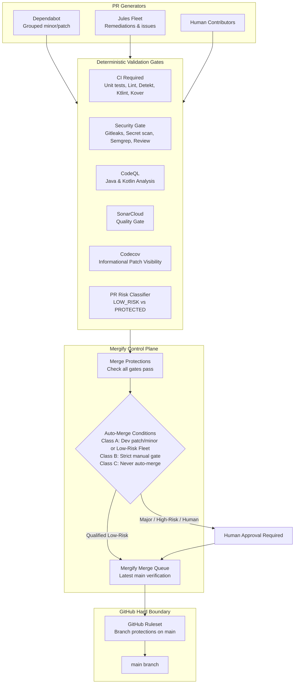

# Autonomous Repository Maintenance Architecture

## 1. Architecture & Philosophy

This repository implements a **safe, fail-closed, highly autonomous maintenance system** designed to keep dependencies, toolchains, security postures, and CI workflows up to date with minimal manual engineering intervention.



---

## 2. Authority Boundaries & Single Merge Engine

To eliminate race conditions and split-brain states:
- **Single Merge Authority:** **Mergify** is the sole automated merge authority.
- **Jules Fleet Merge:** Kept strictly in diagnostic dry-run mode (`JULES_FLEET_AUTO_MERGE_ENABLED=false`).
- **Native GitHub Merge Queue:** Disabled to prevent conflicting dual-queue synchronization.

---

## 3. Dependabot Configuration

- **Authoritative Dependency Updater:** Dependabot runs weekly on Sundays (`schedule: interval: weekly`).
- **All Ecosystems Covered:**
  - `github-actions`: `/`
  - `gradle`: `/`
  - `pip`: `/scripts/ci`
  - `npm`:
    - `/side-projects/admin-notifications`
    - `/side-projects/cloudflare/workers/admin-api`
    - `/side-projects/cloudflare/workers/content-api`
    - `/side-projects/cloudflare/workers/ssv-callback`
    - `/side-projects/firebase/functions`
    - `/side-projects/firebase/rules-tests`
- **Rebase Strategy:** `rebase-strategy: disabled` is explicitly set to prevent excessive CI churn while PRs await Mergify queue processing.
- **Grouping:** Patch and minor updates are grouped per ecosystem. Semver-major updates are raised as standalone PRs.
- **Sensitive Dependencies Isolated:** Gradle, Kotlin, AGP, KSP, Hilt, Room, Firebase plugins, Play Billing, and Play Publisher are excluded from automated grouping.

---

## 4. Jules Fleet Automation

- **Goal-Driven Self-Healing:** Jules analyzes CI health, dependency posture, and security alerts, raising focused remediation issues and PRs.
- **Safety Boundaries:**
  - Automated PRs run the deterministic `classify_pr.py` classifier.
  - Changes are labeled `risk:low` / `fleet-merge-ready` only if they touch unprivileged app code or docs.
  - Any PR touching protected infrastructure receives `fleet-review-required` and cannot auto-merge.

---

## 5. Mergify Engine

Configured in `.mergify.yml` using the latest official schema:
- **`merge_protections`**: Enforces that hard gates pass before any PR is merge-eligible:
  - `CI Required`
  - `Repository Security`
  - `Security Gate`
  - `SonarCloud Code Analysis`
- **`auto_merge_conditions`**: Restricted solely to:
  - Dependabot dev patch and minor updates (excluding sensitive coordinates).
  - Jules Fleet PRs verified as `risk:low` with label `fleet-merge-ready`.
  - Circuit breaker label `-label = automerge:disabled`.
- **`queue_rules`**:
  - `name: default`, `merge_method: squash`, `batch_size: 1`.

---

## 6. GitHub Rulesets (Hard Security Boundary)

Repository rulesets on `main` enforce:
- Required PR before merging.
- No direct push.
- No force push.
- No branch deletion.
- Required status checks: `CI Required`, `Repository Security`, `Security Gate`, `SonarCloud Code Analysis`, `Mergify Merge Protections`.

---

## 7. SonarQube Cloud Integration

- **Model:** GitHub App Automatic Analysis / Clean-as-You-Code.
- **Status:** Hard Quality Gate required for merge eligibility.
- **Protection:** External advisory bots with rate limits (e.g. CodeRabbit) are never treated as blocking hard gates.

---

## 8. Codecov Integration

- **Engine:** `codecov/codecov-action` pinned to full commit SHA (`0fb7174895f61a3b6b78fc075e0cd60383518dac`, v5.5.5).
- **Policy:** Informational (`informational: true` in `codecov.yml`, `fail_ci_if_error: false` in workflows).
- **Local Source of Truth:** Kover remains the authoritative coverage validator.

---

## 9. CodeQL & Kotlin Compatibility Ceiling

- **Ceiling Policy:** Recorded in `config/codeql-compatibility-policy.json`.
- **Enforcement:** `scripts/ci/codeql_kotlin_compatibility_test.py` validates that `gradle/libs.versions.toml` Kotlin compiler stays below the CodeQL ceiling (currently `< 2.4.10` for CodeQL bundle 2.26.1).

---

## 10. Autonomy Risk Tiers

| Tier | PR Types | Policy |
|---|---|---|
| **Class A (Autonomous)** | Dependabot dev patch/minor, Action patch/minor, Jules Fleet `risk:low` | Auto-queued and merged by Mergify after all gates pass |
| **Class B (Enhanced Guarded)** | Side-project prod patch/minor, non-breaking runtime library patches | Allowed only if full CI and integration tests pass |
| **Class C (Manual Approval Required)** | Any semver-major bump, Gradle/Kotlin/AGP toolchain, Auth, Billing, DB migrations, `.github/**`, `.mergify.yml` | Never auto-merged; human approval required |

---

## 11. Circuit Breakers & Kill Switches

1. **Global Maintenance Kill Switch:**
   - Variable `AUTONOMOUS_MAINTENANCE_ENABLED=false` disables automated Fleet issue/PR creation.
2. **Global Auto-Merge Kill Switch:**
   - Variable `AUTONOMOUS_MERGE_ENABLED=false` disables automated Mergify qualification.
3. **Per-PR Circuit Breaker Label:**
   - Adding label `automerge:disabled`, `hold`, or `do-not-merge` immediately disqualifies the PR from auto-merge.

---

## 12. Maintenance Health Controller & Dashboard

- **Workflow:** `.github/workflows/maintenance-health.yml` runs daily at 06:00 UTC.
- **Script:** `scripts/ci/maintenance_health_controller.py`.
- **Dashboard Issue:** Automatically creates or updates the single consolidated issue: `"Autonomous Maintenance Dashboard"`. No issue spam.

---

## 13. How to Safely Disable Automation

To completely suspend all autonomous actions:
```bash
gh variable set AUTONOMOUS_MAINTENANCE_ENABLED --body "false"
gh variable set AUTONOMOUS_MERGE_ENABLED --body "false"
gh variable set JULES_FLEET_ENABLED --body "false"
gh variable set JULES_FLEET_AUTO_MERGE_ENABLED --body "false"
```
To re-enable:
```bash
gh variable set AUTONOMOUS_MAINTENANCE_ENABLED --body "true"
gh variable set AUTONOMOUS_MERGE_ENABLED --body "true"
```
