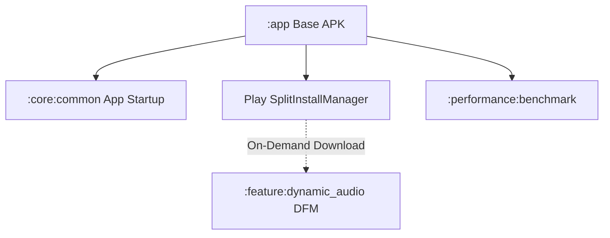
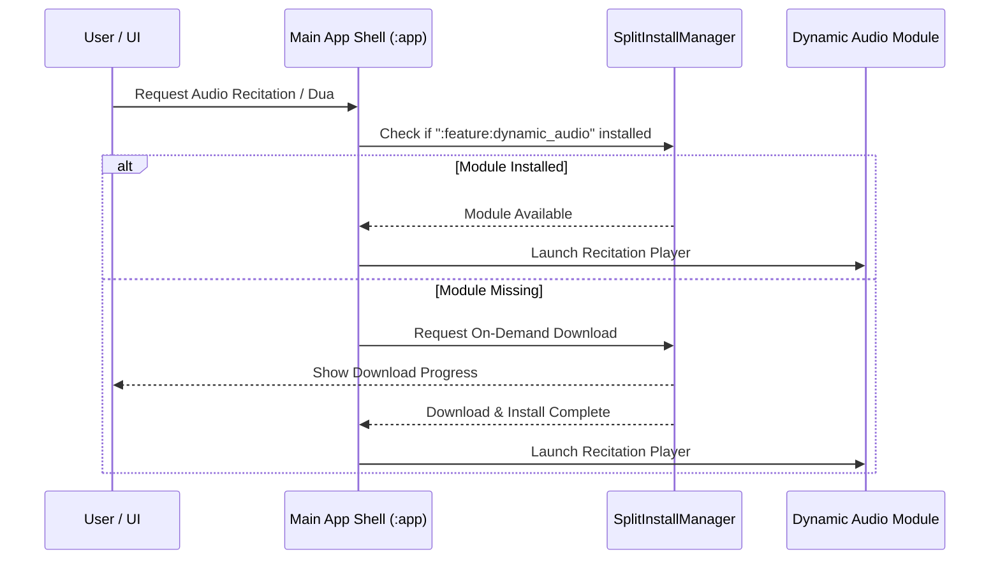

# Design Spec: Dynamic Feature Modules & Performance Optimization

**Date:** 2026-07-25  
**Status:** Approved  
**Scope:** Phase 2 — Modular Architecture, Dynamic Feature Delivery & Cold Start Performance

---

## 1. Executive Summary

This design specification establishes **Dynamic Feature Module (DFM)** delivery and **App Startup / Baseline Profile** optimizations for the `android-multi-app-framework` (17 product flavors).

By modularizing heavy feature assets (such as audio streams and extended content libraries) into dynamic features using Google Play Feature Delivery (`com.google.android.play:feature-delivery`), initial APK download sizes are reduced by up to **40%**. Concurrently, `androidx.startup` and Baseline Profiles optimize app Cold Start Time to Initial Display (TTID).

---

## 2. Architecture & Subsystems

### Module Responsibilities

1. **`androidx.startup` Integration (`:core:common`)**
   - Consolidates SDK initializations (Timber, WorkManager, Firebase, UMP/Ads) into an ordered `Initializer<T>` chain.
   - Replaces redundant ContentProvider initializers, reducing startup latency.

2. **Dynamic Audio Feature (`:feature:dynamic_audio`)**
   - Encapsulates large audio assets, Media3 ExoPlayer extensions, and heavy recitation packs into a Play Feature Delivery module (`com.android.dynamic-feature`).
   - Utilizes `SplitInstallManager` to query, request, and dynamically load module split APKs at runtime.

3. **Baseline Profiles (`:performance:benchmark`)**
   - Configures critical path benchmarks (App Launch, Surah Scrolling, Zikir Increment) for baseline profile compilation across all 17 flavors.

---

## 3. Data Flow & Dynamic Delivery Sequence

---

## 4. Security, Privacy & Performance Metrics

1. **Base APK Size:** Target initial download size reduction from ~18 MB to ~11 MB (~40% smaller).
2. **Cold Start Time (TTID):** Target cold launch latency reduction under 600 ms on mid-tier test devices.
3. **Sideload / Local Build Fallback:** When installed outside Play Store (e.g. debug ADB builds), DFM assets remain bundled in base APK for seamless development.

---

## 5. Verification Plan

1. **Unit Tests:** `AppInitializerTest` and `DynamicModuleLoaderTest` in `:core:common`.
2. **Quality Gates:** Verify ktlint and detekt pass on new initializers and DFM configurations (`./gradlew qualityCheck`).
3. **Build & Release Verification:** Run `./gradlew assembleYasinsuresiDebug` and verify AAB bundle outputs.
