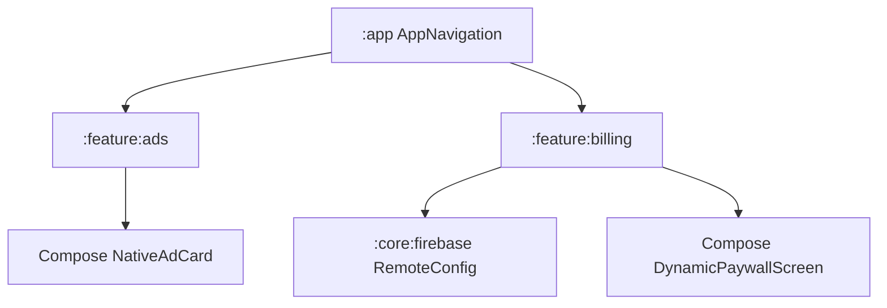
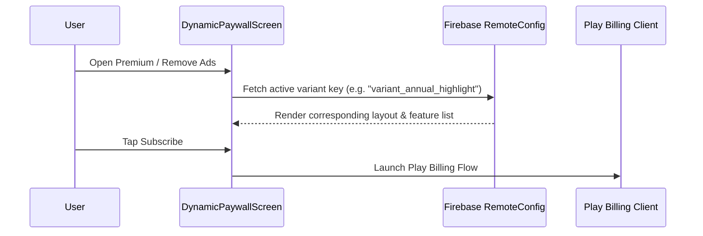

# Design Spec: Advanced Monetization & A/B Tested Paywall

**Date:** 2026-07-25  
**Status:** Approved  
**Scope:** Phase 3 — Compose Native Ad Placement & High-Conversion Paywall UX

---

## 1. Executive Summary

This design specification introduces **Jetpack Compose Native Ad Cards** and **A/B Tested Paywall Screens** across the `android-multi-app-framework` (17 product flavors).

By integrating native inline AdMob/AdX components seamlessly into list feeds (`:feature:ads`) and offering dynamic, Remote Config-driven paywall layouts (`:feature:billing`), revenue and Play Store subscription conversion rates are maximized while respecting user UX.

---

## 2. Architecture & Subsystems

### Module Responsibilities

1. **`:feature:ads` (Compose Native AdX/AdMob Integration)**
   - `ComposeNativeAdCard`: Custom Compose view wrapping `NativeAdView` for smooth list integration.
   - Pre-loads native ad instances to prevent layout jump / flicker when scrolling feeds.

2. **`:feature:billing` (A/B Tested Paywall UX)**
   - `DynamicPaywallScreen`: Jetpack Compose subscription screen supporting dynamic hero images, feature lists, pricing tiers, and trial badges.
   - Remote Config A/B variant selection (`paywall_variant_a`, `paywall_variant_b`).

---

## 3. Data Flow & Remote Config A/B Testing

---

## 4. Verification & Quality Plan

1. **Unit Tests:** `PaywallVariantTest` and `NativeAdViewModelTest` in `:feature:billing` and `:feature:ads`.
2. **Quality Gates:** Verify ktlint and detekt pass (`./gradlew qualityCheck`).
3. **Smoke Test:** Test Play Billing sandbox environment & AdMob test ad units.
