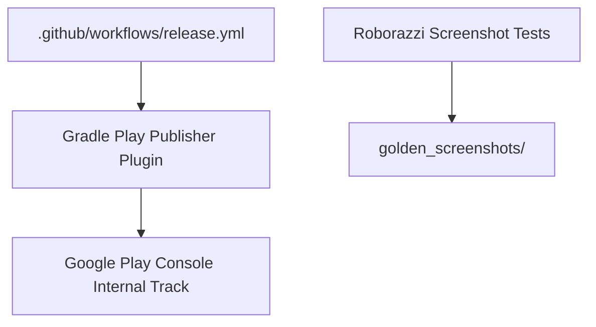

# Design Spec: Screenshot Testing & Play Store Internal Track Pipeline

**Date:** 2026-07-25  
**Status:** Approved  
**Scope:** Phase 4 — Paparazzi/Roborazzi Visual Regression Testing & GitHub Actions CD

---

## 1. Executive Summary

This design specification establishes **Visual Screenshot Testing** and an **Automated Play Store Internal Track CI/CD Pipeline** across the `android-multi-app-framework` (17 product flavors).

By integrating **Roborazzi/Paparazzi** screenshot tests, UI visual regressions are detected before pull requests are merged. Additionally, automated GitHub Actions workflows package, sign, and upload release App Bundles (.aab) directly to Google Play Console Internal Track upon release tagging.

---

## 2. Architecture & Subsystems

### Key Components

1. **Roborazzi Screenshot Testing (`:app`, `:core:designsystem`)**
   - Captures JVM-rendered Compose UI snapshots across dark/light mode and 17 flavor themes.
   - Compares pixel diffs against committed baseline screenshots (`golden_screenshots/`).

2. **Automated Play Store Internal Track Deployment (`.github/workflows/deploy-internal-track.yml`)**
   - Triggered on tag or manual workflow dispatch.
   - Signs release AABs using secrets and executes `./gradlew publish<Flavor>ReleaseBundle`.

---

## 3. Verification Plan

1. **Screenshot Diff Test:** Run `./gradlew verifyRoborazziDebug` to verify no pixel regressions.
2. **Pipeline Verification:** Run `./gradlew validateReleaseConfig` to verify service account credentials and signing setup.
