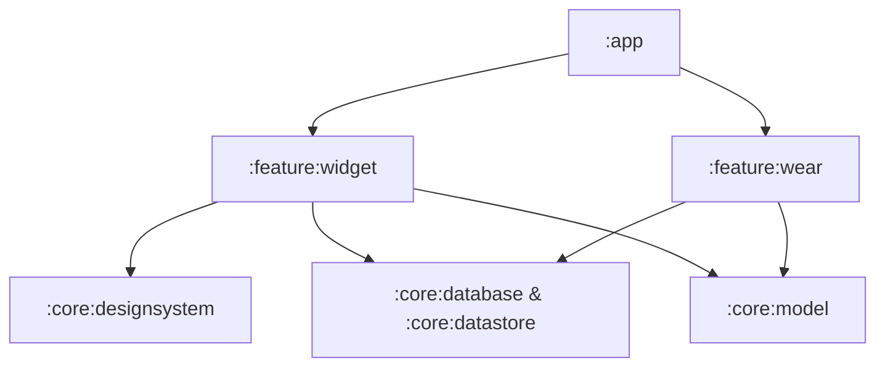
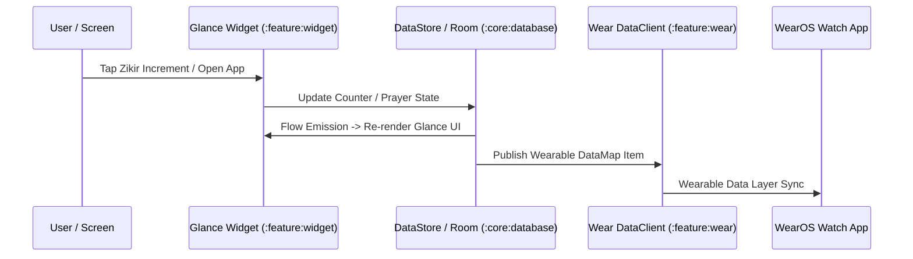

# Design Spec: Jetpack Glance Widgets & WearOS Integration

**Date:** 2026-07-25  
**Status:** Approved  
**Scope:** Phase 1 — User Experience, Home/Lock Screen Widgets & WearOS Ecosystem

---

## 1. Executive Summary

This design specification introduces modern home/lock screen widget capabilities and a companion WearOS smartwatch experience across the `android-multi-app-framework` (17 product flavors). 

By leveraging **Jetpack Glance (`androidx.glance`)** for widgets and **Wear Compose (`androidx.wear.compose`)** for wearables, we maintain 100% Kotlin Compose idiomatic patterns, strict Clean Architecture boundaries, and shared `core` state integration (`core:database`, `core:datastore`, `core:common`).

---

## 2. System Architecture & Module Boundaries

Two new feature modules are added to the workspace:

### Module Responsibilities

1. **`:feature:widget`**
   - Implements `GlanceAppWidget` and `GlanceAppWidgetReceiver` instances.
   - Supports multi-flavor widget rendering based on `AppProductDefinition` capabilities:
     - **Prayer Times Widget:** Displays next prayer time, countdown timer, and location (`namazvakitleri`, `kible`).
     - **Zikir Counter Widget:** Displays active target, current count, and quick increment button (`zikirmatik`).
     - **Verse/Dua of the Day Widget:** Displays daily ayah/dua snippet (`kuran_kerim`, `mucizedualar`, `ayetelkursi`, `yasinsuresi`, etc.).

2. **`:feature:wear`**
   - WearOS standalone tile and app interface using `androidx.wear.compose`.
   - Wearable Data Layer API integration (`com.google.android.gms:play-services-wearable`) for bi-directional state synchronization between phone and watch (e.g. Zikir counter increments sync live).

---

## 3. Detailed Data Flow & Synchronization

### 3.1 Background & Periodic Refresh Strategy
- **Widget Updates:** Handled via `GlanceAppWidget.update(context, glanceId)` triggered by `Room` DB Flow collectors or `WorkManager` (every 15 min for prayer countdowns).
- **Exact Prayer Transition:** `AlarmManager` triggers an exact intent broadcast at prayer time transitions to force immediate widget redraw.

---

## 4. Multi-Flavor Integration & Capabilities

Capability flags in `AppProductDefinition` dictate widget configuration per flavor:

| Capability Flag | Target Flavors | Widget Type Provided |
|---|---|---|
| `widget_prayer_times` | `namazvakitleri`, `kible` | Prayer Countdown & Timetable |
| `widget_counter` | `zikirmatik` | Quick Incremental Tasbih Widget |
| `widget_daily_content` | All Surah & Dua flavors | Daily Ayah / Dua Card Widget |

---

## 5. Security, Privacy & Performance Criteria

1. **Privacy:** Location coordinates used for prayer time widgets remain processed strictly on-device using existing `NominatimReverseGeocoder` policies.
2. **Battery Efficiency:** Glance background updates use batched WorkManager schedules; no persistent foreground services are spawned for widgets.
3. **App Size Overhead:** Glance and Wearable dependencies add < 400 KB to the APK size.

---

## 6. Verification & Testing Plan

1. **Unit Tests:** `GlanceStateDefinition` and Wear `DataClient` payload serializer unit tests in `:feature:widget` and `:feature:wear`.
2. **Quality Gates:** Verify ktlint and detekt pass on new modules (`./gradlew qualityCheck`).
3. **Device Smoke Test:** Install on connected physical test device via `adb` and verify widget rendering.
